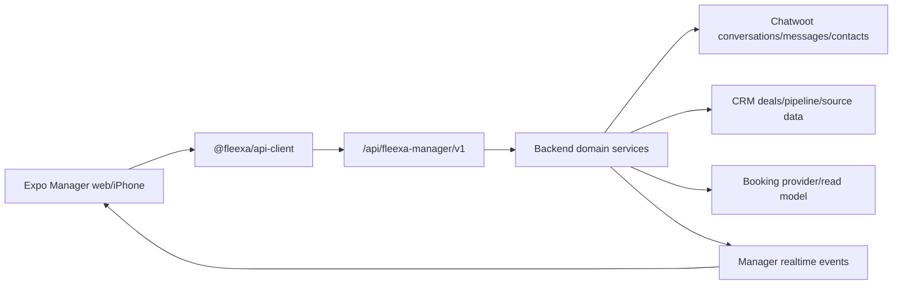
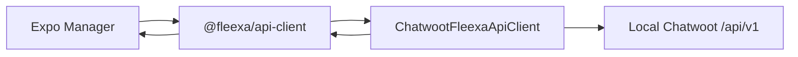

# Fleexa Manager System Architecture

Date: 2026-07-18
Branch: `codex/fleexa-manager-foundation`

## Architecture Position

Fleexa Manager is an Expo React Native application that targets web first and
iPhone later. It is not a Chatwoot Vue extension.

The long-term serving contract is the Fleexa Manager API:

`/api/fleexa-manager/v1`

ADR 0004 accepts a first implementation phase where this API namespace is
implemented inside the patched Chatwoot/Rails app. A separate BFF/API layer
remains the later extraction path once DTOs, permissions, events, and booking
read models stabilize.

## Current Repository Shape

| Layer | Path | Responsibility |
| --- | --- | --- |
| Expo app | `apps/fleexa-manager` | Manager web/iPhone UI shell and screens. |
| API client | `packages/fleexa-api-client` | Typed client, Manager DTO mapping, temporary local Chatwoot adapter. |
| Domain types | `packages/fleexa-domain` | Shared Manager contracts used by app and client. |
| UI primitives | `packages/fleexa-ui` | Cross-platform presentational controls. |
| Runtime config | `packages/fleexa-config` | Environment validation, API mode, driver, Sentry config. |
| Chatwoot patches | `chatwoot-patches/` | Durable Chatwoot/Rails/Vue changes only through patch files. |
| Architecture docs | `docs/fleexa-manager` | Product, API, events, security, readiness, and ADR records. |

## Runtime Modes

| Mode | Purpose | Acceptance |
| --- | --- | --- |
| `apiMode=mock` | UI development only. | Never final acceptance. |
| `apiMode=live`, `apiDriver=chatwoot` | Local real-backend bridge for the current chat vertical slice. | Acceptable for proving local Chatwoot behavior; not the production contract. |
| `apiMode=live`, `apiDriver=manager` | Target Manager API contract. | Required for production Manager acceptance. |

## Target Request Flow

The client receives Manager DTOs only. Raw Chatwoot, CRM database, and booking
provider payloads stay behind the API boundary.

## Current Bridge Flow

The implemented chat vertical slice currently uses:

This bridge maps Chatwoot profile, conversation, and message responses into
Manager DTOs. It proves the real backend path, but production idempotency,
permissions, cursor semantics, and error envelopes still belong in the Manager
API namespace from ADR 0004.

## Backend API Boundary

The Manager API must provide:

- current session and active account membership
- account-scoped conversation list and detail
- message list and text send
- linked deal summary
- pipeline stages and deals by stage
- booking by deal
- manager counters
- booking webhooks
- realtime events
- safe error responses

Every account-scoped endpoint must verify membership, permission, and resource
ownership before returning data.

## Business Logic Boundary

Business logic belongs in backend/API/domain services, not UI screens.

Examples:

- reply eligibility and channel send rules
- deal stage transition validation
- required field and loss reason rules
- source attribution detection and clarification
- booking normalization and conflict handling
- customer identity matching
- manager counters and KPI formulas
- permission-filtered actions

Expo screens may render, format, compose, and hold local UI state. They must not
be the source of truth for product rules.

## Data Ownership

Current source data remains inside Chatwoot and CRM tables. Manager should
consume that data only through normalized API responses.

Future data such as booking read models, idempotency records, event cursors, and
customer identity match audit may start in the Rails-hosted phase if ADR 0004 is
followed, but those boundaries should remain extractable.

## Realtime

Realtime is a Manager event facade, not a direct ActionCable mirror. The event
contract uses account-scoped cursors, permission filtering, replay, and Manager
DTO payloads.

Chatwoot ActionCable can be a source, but Manager clients should connect to the
Manager realtime endpoint once implemented.

## Security

Security requirements:

- short-lived Manager auth and realtime tokens
- secure storage abstraction on the client
- account isolation on every route
- endpoint permissions, not UI-derived role checks
- idempotency on mutations and webhooks
- safe, mobile-readable error envelopes
- no secrets in Expo config or committed env files

## Evolution Path

1. Keep the current Chatwoot adapter only as a local bridge.
2. Implement the Manager API namespace inside Chatwoot/Rails through patches.
3. Point Expo live mode at `/api/fleexa-manager/v1`.
4. Move backend business rules into service objects with tests.
5. Add booking read model, idempotency, and realtime event persistence.
6. Revisit a separate BFF/API extraction after the contract is proven.
